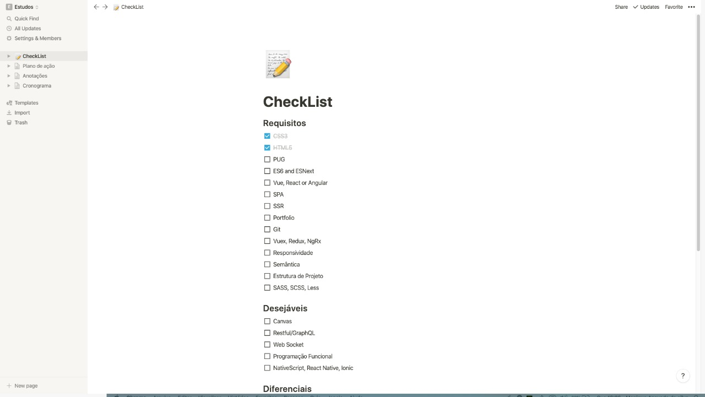
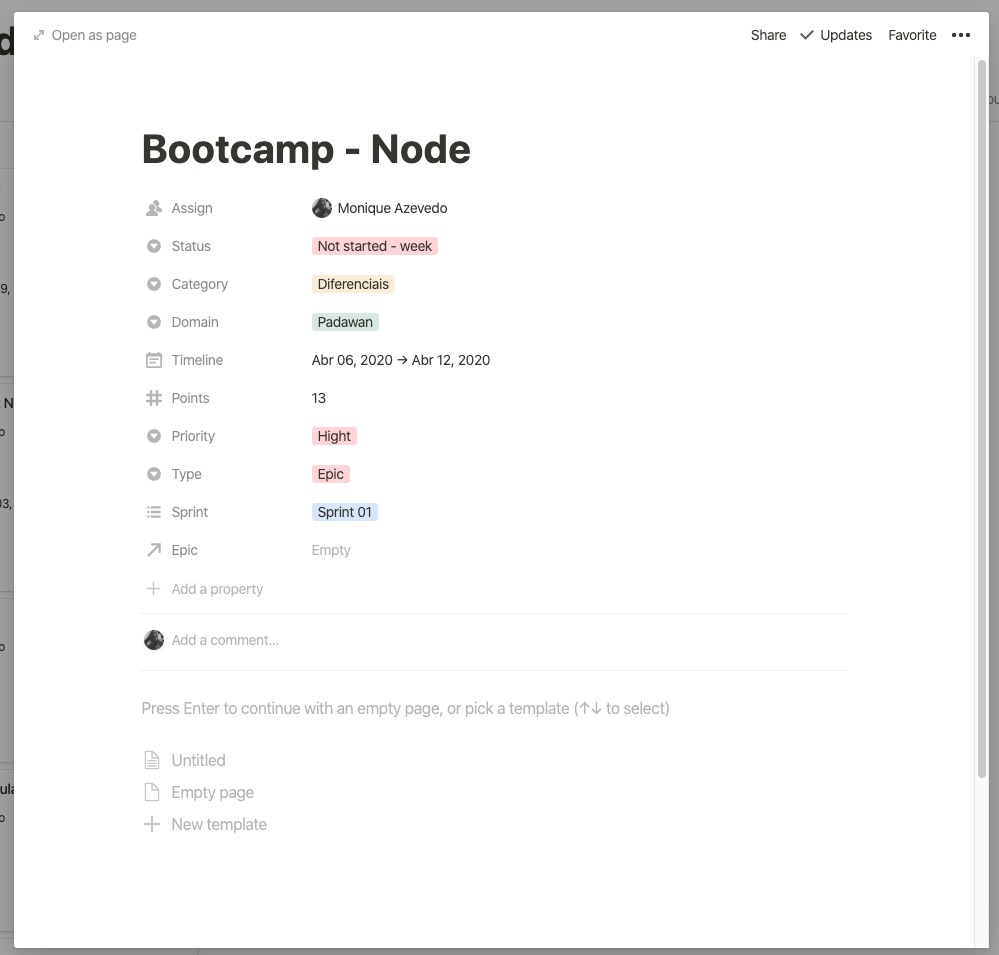
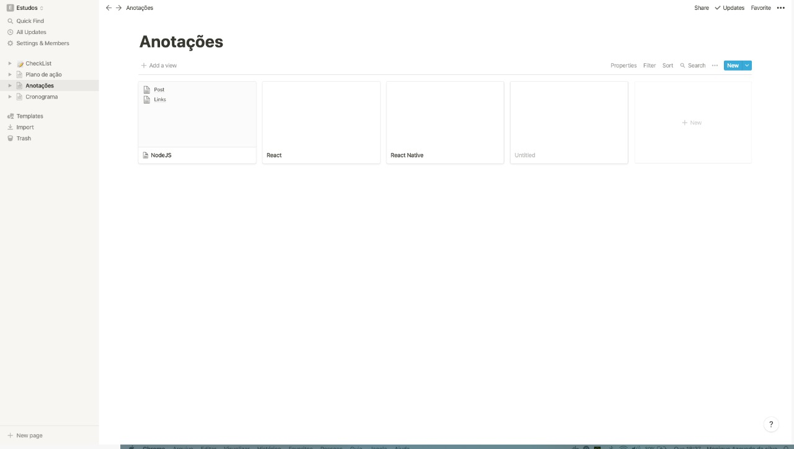
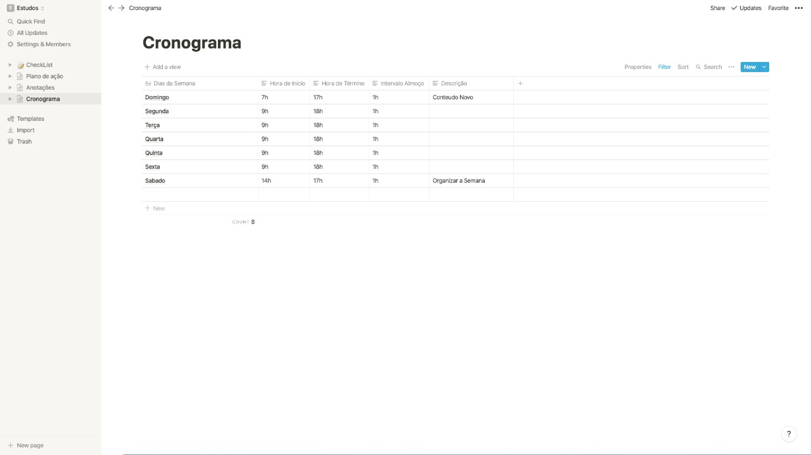

<h3 align="center">
  Desafio 1: Planejando meus estudos
</h3>

Primeiro desafio do Bootcamp 11 que trata da criação de um cronograma de estudos.

  <a href="#organização-de-estudos">Organização de estudos</a>&nbsp;&nbsp;&nbsp;|&nbsp;&nbsp;&nbsp;
  <a href="#primeira-parte">Primeira parte</a>&nbsp;&nbsp;&nbsp;|&nbsp;&nbsp;&nbsp;
  <a href="#segunda-parte">Segunda parte</a>&nbsp;&nbsp;&nbsp;|&nbsp;&nbsp;&nbsp;
  <a href="#terceira-parte">Terceira parte</a>&nbsp;&nbsp;&nbsp;|&nbsp;&nbsp;&nbsp;
  <a href="#quarta-parte">Quarta parte</a>&nbsp;&nbsp;&nbsp;|&nbsp;&nbsp;&nbsp;
  <a href="#memo-licença">Licença</a>

## Organização de Estudos

O meu cronograma tem como objetivo não as aulas do bootcamp e sim os requisitos de uma vaga que etou interessada.

Como eu acabei de perder o emprego por da crise atual, e eu tenho muita pratica em estudar por um tempo muito longo, eu resolvi manter e organizar os meus estudos o mais proximo possivel da rotina de trabalho que tinha.

### Primeira parte

  

Primeiro eu criei uma lista com todos os requisitos da vaga dividido de acordo com o que eles especificaram. A ideia aqui não é só de marcar o que eu já sei ou não, isso vai acontecer, e não será na ordem que está na lista, a segunda parte irá cuidar disso, a ideia dessa lista é mera organização e dopamina conforme eu for marcando no futuro.

### Segunda parte

  

Como eu optei por manter uma rotina de trabalho, eu listei como tarefas todos os requisitos da vaga e irei tratar o meu estudo como uma sprint, onde irá durar uma semana e a quantidade de tarefas por sprint vai depender da pontuação que eu dei pra ela. Eu já realizei uma analise rapida e pontuei todas as tarefas, estabeleci dominio, categoria, prioridade e por ai vai.

Exemplo:

  

### Terceira parte

  

Ainda não ficou muito bem definida, porem a minha ideia é de usar essa area para fazer anotações de cada modulo ou cada conteudo que eu veja, guardar links, referencias, criar um post, é uma area livre e organizada que eu vou adicionando conforme eu for passando pelo conteudo. Ainda não defini qual será o momento para isso.

### Quarta parte

  

Aqui é uma ideia de cronograma semanal, como eu comentei, irei dar continuidade a um horario de trabalho normal, já possuo o habito de estudar por longos periodos, eu não deixei claro no cronograma mas muito provavelmente irei usar a tecnica do pomodoro, é uma tecnica que me ajuda bastante nesse sentido.

### Comentarios finais

Sei que não segui o modelo sugerido por vocês, porem eu já havia organizado essa dinamica antes mesmo de ver a aula, acho que só adicionei a parte do cronograma, porem foi mais a nivel de registro e ajuda com o comprometimento.

## :memo: Licença

Esse projeto está sob a licença MIT. Veja o arquivo [LICENSE](LICENSE.md) para mais detalhes.